# AI Financial Analyst

> End-to-end financial forecasting for US-listed enterprise security and software
> vendors, built on free public data (SEC EDGAR + FRED).

---

## TL;DR for reviewers

- **Live dashboard:** [PANW on Tableau Public](https://public.tableau.com/app/profile/sid.den/viz/PANWDashboardUpdated/Dashboard1) — every revenue mark links to its source 10-Q on sec.gov
- **Architectural invariant:** all arithmetic happens in deterministic Python/SQL before the LLM is called; the LLM writes narrative only, and every cited number must trace back to an SEC accession number (parse-then-compare hallucination guard enforces this in CI)
- **Provenance:** seven columns — `concept_used`, `accession_no`, `fact_id`, `filing_url`, `form_type`, `filed_date`, `frame` — flow from XBRL ingest through the Excel Sources sheet and Tableau tooltips
- **Entry points:** `make demo TICKER=PANW` runs the full pipeline; `src/generate_commentary.py` is the LLM call; `tests/eval/` is the ground-truth harness

---

## Pipeline

XBRL ingest → DuckDB warehouse → three forecasts (Prophet / AutoARIMA / Lasso+FRED)
→ Excel three-statement model with a Sources sheet → Tableau dashboard → AI variance
commentary with inline accession citations. Five-scenario eval harness in CI.

---

## Architecture

```mermaid
flowchart LR
    %% Sources
    SEC[("SEC EDGAR<br/>XBRL")]
    FRED[("FRED API<br/>macro series")]
    YF[("yfinance<br/>ETF returns")]

    %% Ingestion / warehouse
    ING["ingest_edgar.py<br/>7 provenance columns"]
    WH[("DuckDB warehouse<br/>v_canonical_facts<br/>(form-priority dedup)<br/>v_income_statement_quarterly<br/>v_balance_sheet_quarterly<br/>v_cash_flow_quarterly<br/>v_data_quality")]

    %% Forecast notebooks
    BASE["nb/02 baseline_forecast<br/>Prophet + AutoARIMA"]
    MACRO["nb/03 macro_regularized<br/>Lasso + FRED + yfinance"]
    FCST[("models/*.parquet<br/>forecast medians + CIs")]

    %% Variance + refusal
    VAR["build_variance_facts.py"]
    VVF[("v_variance_facts<br/>actuals + forecasts +<br/>derived metrics")]
    GATE{{"Refusal checks<br/>restatement / GC / MW /<br/>missing quarters"}}
    STOP[["Refused — exit 1"]]

    %% Build artifacts
    EXC["build_excel_model.py<br/>3-statement + Sources"]
    TAB["export_for_tableau.py<br/>star schema CSVs"]
    CMT["generate_commentary.py<br/>reasoning-vs-computation"]
    GUARD[/"Hallucination guard<br/>parse-then-compare"/]
    NLM["build_notebooklm_bundle.py"]

    %% Outputs
    XLSX[("&lt;TICKER&gt;_model.xlsx")]
    CSVS[("tableau_data/<br/>5 CSVs + .hyper")]
    PUB[("Tableau Public<br/>dashboard")]
    MD[("&lt;TICKER&gt;_exec_commentary.md")]
    BUNDLE[("notebooklm_bundle/<br/>10 files")]

    %% Edges
    SEC --> ING --> WH
    WH --> BASE --> FCST
    WH --> MACRO
    FRED --> MACRO
    YF --> MACRO
    MACRO --> FCST
    WH --> VAR
    FCST --> VAR
    VAR --> VVF
    VVF --> GATE
    GATE -->|refuse| STOP
    GATE -->|clean| CMT
    WH --> EXC
    FCST --> EXC
    EXC --> XLSX
    WH --> TAB --> CSVS
    CSVS -.->|manual<br/>publish| PUB
    CMT --> GUARD
    GUARD -->|fail| CMT
    GUARD -->|pass| MD
    XLSX --> NLM
    MD --> NLM
    FCST --> NLM
    WH --> NLM
    NLM --> BUNDLE

    %% Styling
    classDef source fill:#e0f2fe,stroke:#0284c7,color:#0c4a6e
    classDef pipeline fill:#fef3c7,stroke:#d97706,color:#78350f
    classDef guard fill:#fee2e2,stroke:#dc2626,color:#7f1d1d,stroke-width:2px
    classDef output fill:#dcfce7,stroke:#16a34a,color:#14532d

    class SEC,FRED,YF source
    class ING,BASE,MACRO,VAR,EXC,TAB,CMT,NLM pipeline
    class GATE,GUARD,STOP guard
    class WH,FCST,VVF,XLSX,CSVS,PUB,MD,BUNDLE output
```

The dotted arrow `tableau_data → Tableau Public` is a manual operator step (open `.hyper` in Tableau Desktop, republish). All other edges are automated pipeline steps.

---

## Modeling

Three independent forecasts (Prophet, AutoARIMA, FRED-regularised LassoCV) run side-by-side. With ~20 quarterly observations, no single model is statistically defensible — the ensemble shows the *range* of plausible outcomes, not a point estimate.

---

## Provenance

Every fact in the pipeline carries seven provenance columns from ingestion through
to the Excel Sources sheet and Tableau tooltips:

| Column | Example |
|---|---|
| `concept_used` | `RevenueFromContractWithCustomerExcludingAssessedTax` |
| `accession_no` | `0001327567-26-000123` |
| `fact_id` | SHA-256 of (ticker, concept, period, accession) |
| `filing_url` | `https://www.sec.gov/Archives/edgar/data/…` |
| `form_type` | `10-K` |
| `filed_date` | `2026-02-20` |
| `frame` | `CY2025Q3I` |

The `form_type` + `filed_date` fields power the **restatement detection** logic:
only true 10-K/A or 10-Q/A amendments are flagged — routine 10-Q → 10-K
preliminary-to-final value drift is handled silently.

---

## Dashboard

**Tableau Public dashboard:** https://public.tableau.com/app/profile/sid.den/viz/PANWDashboardUpdated/Dashboard1
Live: https://public.tableau.com/app/profile/sid.den/viz/PANWDashboardUpdated/Dashboard1

Regenerate with `make dashboard TICKER=PANW`, then republish per `dashboard/Tableau_Setup.md`.

**Currently published (v1):** Revenue Actuals, Margins %, Revenue Growth — all with click-through to source SEC filings.

**Speced, not yet authored (v2):** KPI strip, FCF bridge, Profitability stack, Forecast overlay (capped 4Q out), DSO, Billings proxy, Rule of 40 quadrant, Forecast vs Actuals scorecard. Calc fields and layout in `dashboard/Tableau_Setup.md` §4.

---

## LLM Commentary

`src/generate_commentary.py` follows a reasoning-vs-computation split — a standard production pattern for LLMs over numeric data:

1. Python pulls pre-computed variances from DuckDB; the LLM never sees raw data
2. Refusal checks: restatement detected → exit non-zero, no API call
3. Python pre-formats every number with its `accession_no`
4. The LLM writes narrative with inline citations (`[0001327567-26-000123]`)
5. Parse-then-compare hallucination guard validates every numeric token

The guard catches: number fabrication, unit drift (M↔B), word-form numbers, parens-negatives, bare numeric tokens, missing or unknown citations.

Model selection happens at runtime via `/v1/models` — no hardcoded snapshot IDs. Drafts can be validated offline with `python -m src.validate_commentary` (no warehouse, no API key); see `docs/VALIDATE_COMMENTARY.md`.

---

## Eval Harness

Five ground-truth variance scenarios in `tests/eval/fixtures/`. CI exercises the **mechanical-driver detection and the hallucination-guard plumbing** end-to-end. The LLM itself is not called from CI — each scenario uses a synthetic commentary string that hits the relevant guard rule.

| Scenario | Expected outcome |
|---|---|
| VOLUME-driven | Commentary names volume as dominant driver |
| MARGIN-driven | Commentary names margin compression/expansion |
| ONE-TIME | Commentary names one-time item (tagged in fixture) |
| MIX-NOT-COMPUTABLE | Commentary hedges; does not guess |
| RESTATEMENT | Pipeline refuses; exits non-zero; never calls API |

Drivers are restricted to mechanical decompositions computable from input. Causal narratives ("Cortex platform momentum") aren't tested — rewarding the model for them contradicts the anti-speculation rules in Prompt 8.

> **Coverage note:** the harness validates deterministic plumbing, not real LLM output. Live narrator evaluation against the fixtures is v2. See `docs/MODELING_DECISIONS.md` §7.

---

## NotebookLM

`make notebooklm` assembles a source bundle at `dashboard/notebooklm_bundle/` (10-K PDF, historical financials CSV with provenance, forecast summary, exec commentary, test + eval reports). Upload to NotebookLM and ask: *"For the $1.2B revenue figure in the commentary, what is the source filing?"*

---

## Scope and trade-offs

**Deliberate v1 → v2:**
- **NGS ARR:** PANW's headline non-GAAP metric isn't structured XBRL — out of scope for v1
- **Simplified balance sheet:** working capital beyond AR/AP/Inventory/DeferredRevenue is aggregated into `OtherWC`; full SaaS-grade modeling is v2
- **Live LLM eval:** harness exercises deterministic plumbing only; running the live narrator against fixtures is v2

**Honest caveats:**
- **Small sample:** ~20 quarterly observations per company — forecast intervals are wide by design and disclosed in every output
- **Filing lag:** 10-Qs arrive ~30–45 days post-quarter-end; the dashboard's "as of" date is a floor, not a stale-data bug
- **Guard coverage:** the parser catches every numeric token but won't catch wrong attribution (revenue described as a margin) or cross-paragraph logical drift
