# AI Financial Analyst

> End-to-end AI-augmented financial forecasting for US-listed enterprise security
> and software vendors, built entirely on free public data (SEC EDGAR + FRED).

---

## Overview

This project automates the financial analyst workflow end-to-end:

1. **Ingest** — pulls structured XBRL facts from SEC EDGAR with full provenance
   (every number carries an accession number and filing URL)
2. **Warehouse** — DuckDB analytics layer with IS/BS/CF views, data-quality flags,
   restatement detection, and post-forecast variance views
3. **Model** — three independent revenue forecasts (Prophet, AutoARIMA, Lasso with
   FRED macro features) with honest uncertainty quantification at small sample sizes
4. **Excel model** — simplified three-statement model (Base/Bull/Bear scenarios)
   with a per-cell Sources sheet tracing every historical value to its filing
5. **Dashboard** — Tableau Public dashboard with click-through to source filings
6. **Commentary** — AI-generated CFO-style variance commentary using the
   reasoning-vs-computation split (all arithmetic in Python; the LLM writes
   narrative only, with inline accession-level citations)
7. **Eval harness** — 5 ground-truth variance scenarios including
   refusal-on-restatement, tested in CI

---

## Architecture

```mermaid
flowchart LR
    %% Sources
    SEC[("SEC EDGAR<br/>XBRL")]
    FRED[("FRED API<br/>macro series")]
    YF[("yfinance<br/>ETF returns")]

    %% Ingestion / warehouse
    ING["ingest_edgar.py<br/>7 provenance columns<br/>form-priority dedup"]
    WH[("DuckDB warehouse<br/>v_income_statement<br/>v_balance_sheet<br/>v_cash_flow<br/>v_data_quality")]

    %% Forecast notebooks
    BASE["nb/02 baseline_forecast<br/>Prophet + AutoARIMA"]
    MACRO["nb/03 macro_regularized<br/>Lasso + FRED + yfinance"]
    FCST[("models/*.parquet<br/>forecast medians + CIs")]

    %% Variance + refusal
    VAR["build_variance_facts.py"]
    VVF[("v_variance_facts<br/>actuals + forecasts +<br/>derived metrics")]
    GATE{{"Refusal checks<br/>restatement / GC / MW /<br/>missing quarters"}}
    STOP[["Refused — exit 1"]]

    %% Build artifacts
    EXC["build_excel_model.py<br/>3-statement + Sources"]
    TAB["export_for_tableau.py<br/>star schema CSVs"]
    CMT["generate_commentary.py<br/>reasoning-vs-computation"]
    GUARD[/"Hallucination guard<br/>parse-then-compare"/]
    NLM["build_notebooklm_bundle.py"]

    %% Outputs
    XLSX[("&lt;TICKER&gt;_model.xlsx")]
    CSVS[("tableau_data/<br/>5 CSVs + .hyper")]
    PUB[("Tableau Public<br/>dashboard")]
    MD[("&lt;TICKER&gt;_exec_commentary.md")]
    BUNDLE[("notebooklm_bundle/<br/>10 files")]

    %% Edges
    SEC --> ING --> WH
    WH --> BASE --> FCST
    WH --> MACRO
    FRED --> MACRO
    YF --> MACRO
    MACRO --> FCST
    WH --> VAR
    FCST --> VAR
    VAR --> VVF
    VVF --> GATE
    GATE -->|refuse| STOP
    GATE -->|clean| CMT
    WH --> EXC
    FCST --> EXC
    EXC --> XLSX
    WH --> TAB --> CSVS
    CSVS -.->|manual<br/>publish| PUB
    CMT --> GUARD
    GUARD -->|fail| CMT
    GUARD -->|pass| MD
    XLSX --> NLM
    MD --> NLM
    FCST --> NLM
    WH --> NLM
    NLM --> BUNDLE

    %% Styling
    classDef source fill:#e0f2fe,stroke:#0284c7,color:#0c4a6e
    classDef pipeline fill:#fef3c7,stroke:#d97706,color:#78350f
    classDef guard fill:#fee2e2,stroke:#dc2626,color:#7f1d1d,stroke-width:2px
    classDef output fill:#dcfce7,stroke:#16a34a,color:#14532d

    class SEC,FRED,YF source
    class ING,BASE,MACRO,VAR,EXC,TAB,CMT,NLM pipeline
    class GATE,GUARD,STOP guard
    class WH,FCST,VVF,XLSX,CSVS,PUB,MD,BUNDLE output
```



The dotted arrow `tableau_data → Tableau Public` is a manual operator step (open `.hyper` in Tableau Desktop, republish). All other edges are automated pipeline steps.

<details>
<summary>Plain-text version (for environments where Mermaid does not render)</summary>

```
SEC EDGAR XBRL                FRED API           yfinance
     │                           │                   │
     ▼                           ▼                   ▼
src/ingest_edgar.py ──────► src/build_warehouse.py (DuckDB)
  (provenance columns:              │
   accession_no, fact_id,           ├── v_income_statement_quarterly
   form_type, filed_date)           ├── v_balance_sheet_quarterly
                                    ├── v_cash_flow_quarterly
                                    ├── v_key_metrics
                                    ├── v_data_quality
                                    └── v_variance_facts (post-forecast)
                                         │
                    ┌────────────────────┼───────────────────────┐
                    ▼                    ▼                       ▼
          Prophet + AutoARIMA      Lasso (FRED macro)     build_excel_model.py
          (nb/02_baseline)         (nb/03_macro)           3-statement + Sources
                    │                    │                       │
                    └────────────────────┘                       │
                                    │                            │
                                    ▼                            ▼
                         src/generate_commentary.py      export_for_tableau.py
                          ┌──────────────────────────┐         │
                          │ STEP 1: Pull from DuckDB  │         ▼
                          │ STEP 2: Refusal checks    │   Tableau Public
                          │ STEP 3: Pre-format JSON   │   (dim_filing tooltips
                          │ STEP 4: LLM → narrative   │    link to EDGAR)
                          │ STEP 5: Hallucination guard│
                          └──────────────────────────┘
```

</details>

**Key architectural invariant — reasoning vs. computation split:**
All arithmetic happens in deterministic Python/SQL before the LLM is called.
The LLM generates narrative only.  Every number cited in the commentary must
appear verbatim in the input JSON and traces back to an SEC accession number.

---

## Modeling

Three independent revenue forecasting models are run and compared:

- **Prophet** (Bayesian, Stan backend) — trend + seasonality decomposition with
  proper Bayesian credible intervals
- **AutoARIMA** (statsforecast) — auto-selects ARIMA order via information criteria
- **LassoCV** (scikit-learn) — regularised linear model with FRED macro features
  (yield curve, CPI YoY, Fed funds rate, sector ETF return, industrial production)

All three models are honest about uncertainty: with ~20 quarterly observations,
no single model is statistically defensible.  The ensemble characterises the
*range* of plausible outcomes rather than claiming predictive precision.

---

## Provenance

Every fact in the pipeline carries seven provenance columns from ingestion through
to the Excel Sources sheet and Tableau tooltips:

| Column | Example |
|---|---|
| `concept_used` | `RevenueFromContractWithCustomerExcludingAssessedTax` |
| `accession_no` | `0001327567-26-000123` |
| `fact_id` | SHA-256 of (ticker, concept, period, accession) |
| `filing_url` | `https://www.sec.gov/Archives/edgar/data/…` |
| `form_type` | `10-K` |
| `filed_date` | `2026-02-20` |
| `frame` | `CY2025Q3I` |

The `form_type` + `filed_date` fields power the **restatement detection** logic:
only true 10-K/A or 10-Q/A amendments are flagged — routine 10-Q → 10-K
preliminary-to-final value drift is handled silently.

---

## Dashboard

**Tableau Public dashboard:** https://public.tableau.com/app/profile/sid.den/viz/PANW-Financial-Dashboard/Dashboard1

To regenerate: run `make dashboard TICKER=PANW` to refresh the CSVs in
`dashboard/tableau_data/`, then republish following `dashboard/Tableau_Setup.md`.

Sheets in the workbook:

- **Actual vs Forecast** — three-model ensemble with CI bands
- **Variance Drivers** — mechanical decomposition (volume / margin / mix /
  one-time)
- **Forecast Accuracy** — MAE / MAPE across expanding-window CV folds
- **Scenario Toggle** — Base / Bull / Bear from the Excel model

Every data point has a "Source" tooltip showing `accession_no` with a
clickable link to the SEC filing.

---

## LLM Commentary

`src/generate_commentary.py` follows a reasoning-vs-computation split — a
common production pattern for LLMs over numeric data:

1. Python pulls pre-computed variances from DuckDB — the LLM never sees raw data
2. Refusal checks: restatement detected → exit non-zero, no API call
3. Python pre-formats every number with its `accession_no`
4. The LLM writes narrative with inline citations (`[0001327567-26-000123]`)
5. Parse-then-compare hallucination guard validates every numeric token

The guard catches: number fabrication, unit drift (M↔B), word-form numbers
(`billion`/`million`), parens-negatives, bare numeric tokens, missing citations,
citations to accessions not in the input.

Model selection happens at runtime via `/v1/models` — no hardcoded snapshot IDs.

---

## Eval Harness

Five ground-truth variance scenarios in `tests/eval/fixtures/`. The harness exercises
the **mechanical-driver detection logic and the hallucination-guard plumbing** end to
end — the LLM itself is *not* called from CI. Each scenario builds a synthetic
commentary string that exercises the relevant guard rule and asserts the expected
refusal/driver outcome.

| Scenario | Expected outcome |
|---|---|
| VOLUME-driven | Commentary names volume as dominant driver |
| MARGIN-driven | Commentary names margin compression/expansion |
| ONE-TIME | Commentary names one-time item (tagged in fixture) |
| MIX-NOT-COMPUTABLE | Commentary hedges; does not guess |
| RESTATEMENT | Pipeline refuses; exits non-zero; never calls API |

Drivers are restricted to mechanical decompositions computable from input data.
Causal narratives ("Cortex platform momentum") are not tested because rewarding
the model for emitting them contradicts the anti-speculation rules in Prompt 8.

> **Limitation:** the harness validates the deterministic plumbing (refusal logic,
> driver classification, guard rules), not real LLM output. Live model evaluation —
> running the actual narrator and grading its commentary against the fixtures — is
> v2 work. See `docs/MODELING_DECISIONS.md` §7.

---

## NotebookLM

`make notebooklm` assembles a source bundle at `dashboard/notebooklm_bundle/`
including the 10-K PDF, historical financials CSV with provenance, forecast
summary, exec commentary, and test + eval reports.  Upload to NotebookLM and
ask: *"For the $1.2B revenue figure in the commentary, what is the source filing?"*

---

## Limitations

- **Small sample:** ~20 quarterly observations per company — forecast intervals
  are wide by design and honestly disclosed
- **Filing lag:** 10-Q filings arrive ~30–45 days post-quarter-end
- **NGS ARR:** PANW's headline non-GAAP metric is not structured XBRL; out of scope
- **Simplified BS:** Working capital beyond AR/AP/Inventory/DeferredRevenue is
  aggregated into `OtherWC` — full SaaS-grade modeling is v2 work
- **Commentary guard:** Does not catch wrong attribution (revenue described as
  margin) or logical inconsistency across paragraphs
